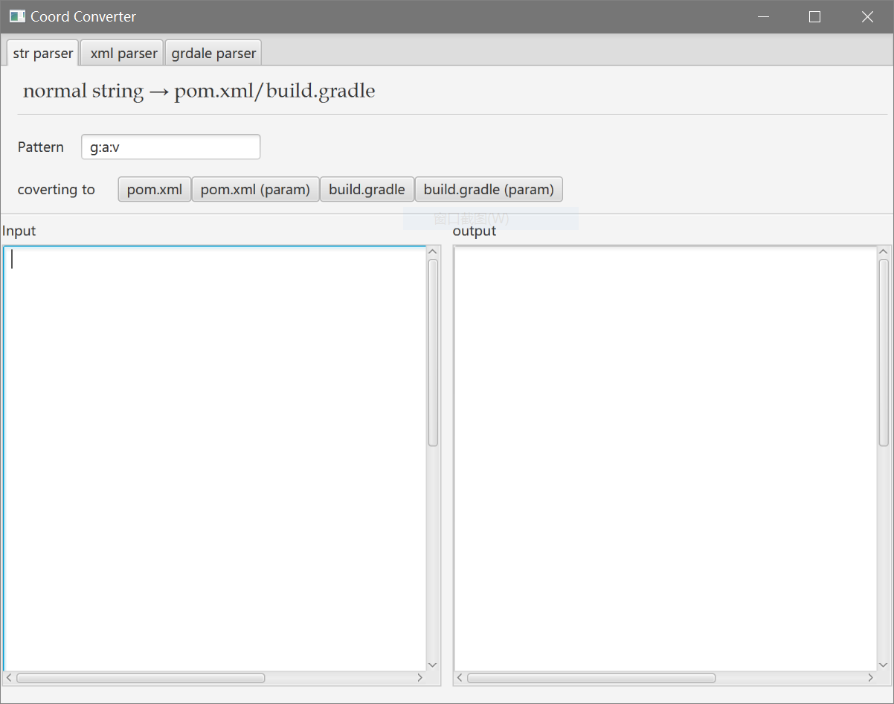
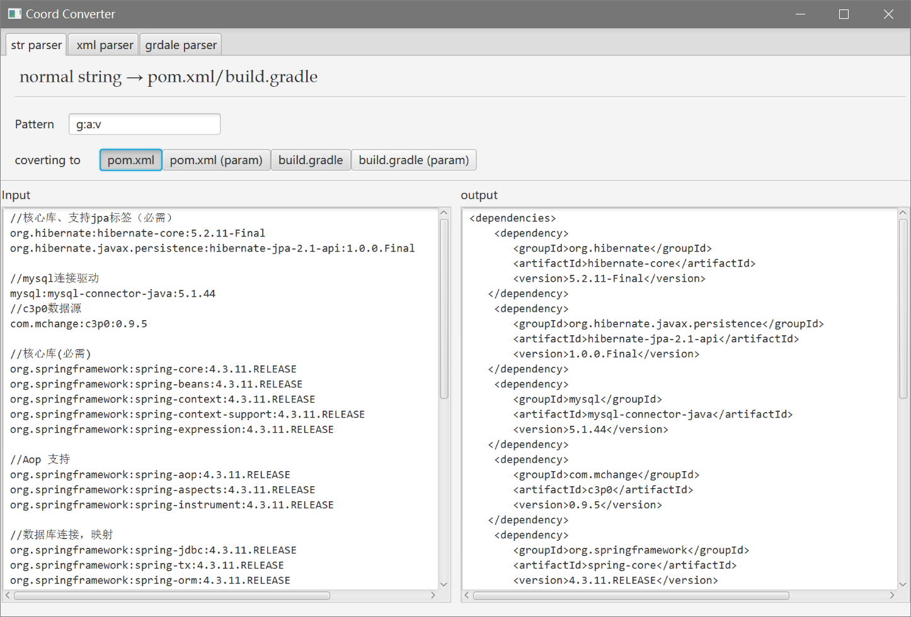
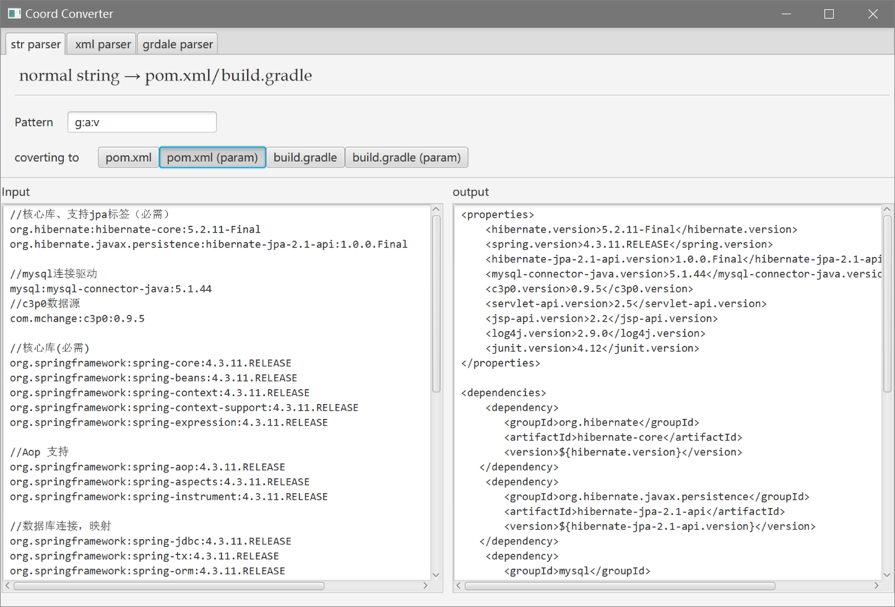
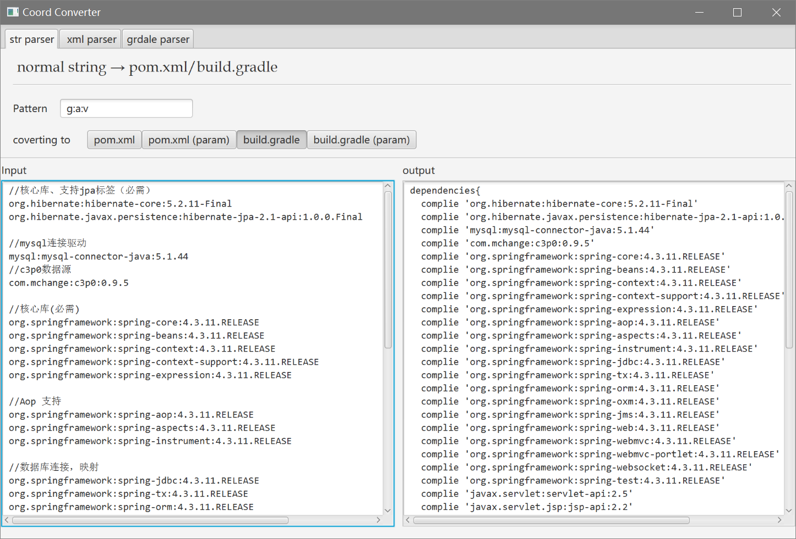
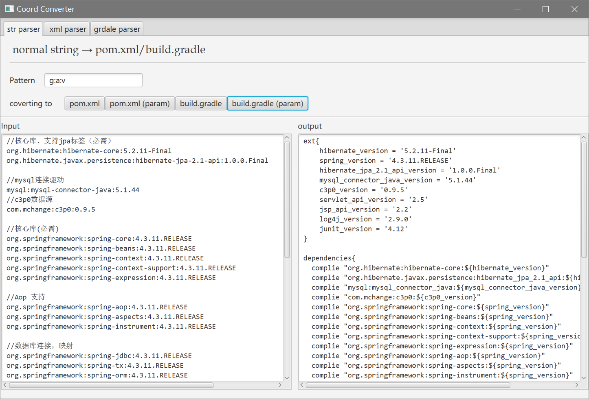
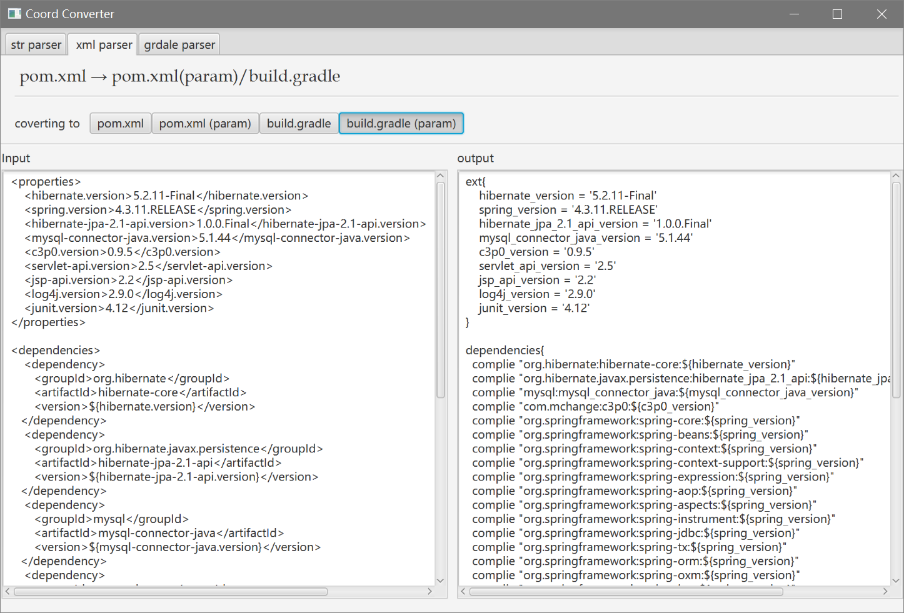
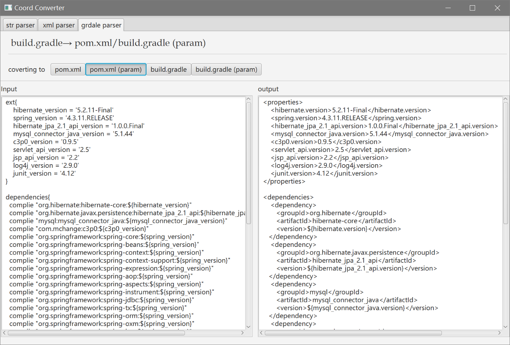

# dependency_converter
pom.xml,build.gradle 依赖代码转化工具

#### 开发说明

   开发这个工具主要是自己日常开发时，使用 gradle 或 maven 在处理依赖源的格式上很麻烦，特别是使用 MSSH 框架时，框架的依赖很多，
而且IDEA，Eclipse 没有相应的批量导入转化插件，一般我和大多数一样，做几个 MSSH 的 Maven，Gradle 框架，之后使用再在这几个基本框架上
增添，当实际上这种该方式有时也很不灵活；  

  
  
  于是我写了这个小工具，用于将类似于“org.springframework:spring-aop:4.3.11.RELEASE”的字段进行批量转化为 pom.xml 和 build.gradle
的代码风格，使用时直接复制这些格式化好的依赖代码，同时支持提取变量风格的 pom.xml /build.gradle 依赖代码，也支持这2种代码之间相互转换；

  为了方便日常使用，使用 JavaFX 写了个壳；  

#### 环境说明   
* 源码构建工具：Gradle
* 开发语言和版本：Kotlin 1.1.4     
               groovy 2.4.10  
* GUI框架： JavaFX  
* 运行环境：JRE 8+  

##### 示例图样
**程序界面**  
   

**将格式文本批量处理为 pom.xml 依赖格式**  
 

**将格式文本批量处理为 pom.xml 依赖格式，同时提取版本变量**      
 

**将格式文本批量处理为 buil.gradle 依赖格式**      
 

**将格式文本批量处理为 buil.gradle 依赖格式，同时提取版本变量**     
 

**支持 buil.gradle 和 pom.xml 依赖格式的相互转化**     
 
 
